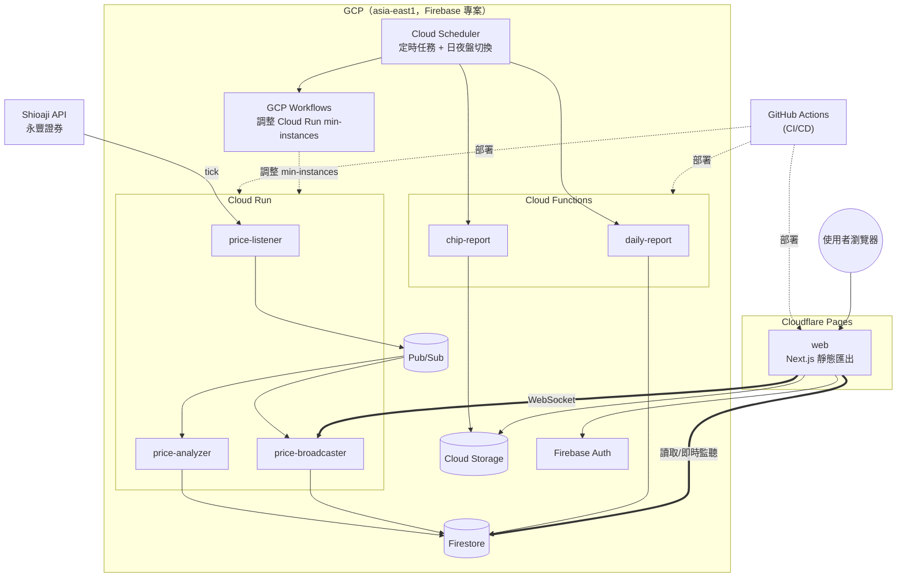
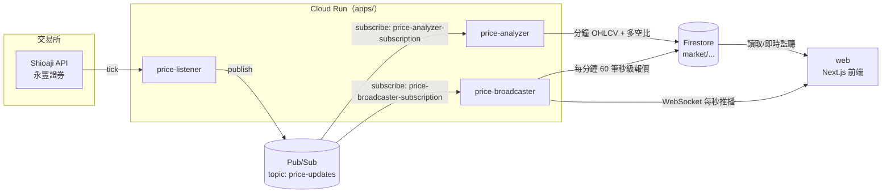
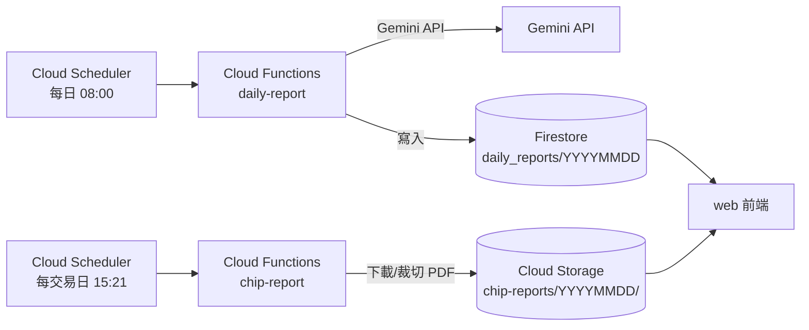

# future-analysis

分析台指期（小型台指期貨）多空交易資訊，即時擷取報價、計算多空指標並提供前端視覺化儀表板。

<a href="https://txfutures.com/" target="_blank">https://txfutures.com </a>

## 專案架構總覽

Monorepo 包含一個前端專案與一組 Python 後端服務（Cloud Run + Cloud Functions），共用同一個 Firebase/GCP 專案。

| 專案 | 說明 | 文件 |
| --- | --- | --- |
| [web/](web) | Next.js 前端（靜態匯出，部署於 Cloudflare Pages），即時走勢圖、分鐘級多空分析、籌碼快訊、每日 AI 報告，登入後直接讀取 Firestore/Storage | [web/README.md](web/README.md) |
| [apps/price-listener/](apps/price-listener) | 透過永豐 Shioaji API 監聽台指期逐筆報價，發布到 Pub/Sub | [apps/price-listener/README.md](apps/price-listener/README.md) |
| [apps/price-analyzer/](apps/price-analyzer) | 訂閱逐筆報價，聚合成分鐘 OHLCV 並計算多空比，並將每秒報價前向填充後存檔，皆寫入 Firestore | [apps/price-analyzer/README.md](apps/price-analyzer/README.md) |
| [apps/price-broadcaster/](apps/price-broadcaster) | 訂閱逐筆報價，透過 WebSocket 每秒廣播給前端 | [apps/price-broadcaster/README.md](apps/price-broadcaster/README.md) |
| [apps/functions/](apps/functions) | 定時任務：每日 AI 市場分析（Gemini）、籌碼快訊圖表擷取 | [apps/functions/README.md](apps/functions/README.md) |
| [apps/libs/pubsub/](apps/libs/pubsub) | 共用 Pub/Sub Publisher / Subscriber 模組 | [apps/libs/pubsub/README.md](apps/libs/pubsub/README.md) |
| [apps/libs/firestore-writer/](apps/libs/firestore-writer) | 共用 Firestore 寫入模組 | [apps/libs/firestore-writer/README.md](apps/libs/firestore-writer/README.md) |

三個 `apps/price-*` 服務與共用模組由同一個 `apps/` uv workspace 管理，詳見 [apps/README.md](apps/README.md)。

## 系統架構

前端與後端分別部署在不同雲端平台：`web` 是靜態匯出的 Next.js 站台，部署在 **Cloudflare Pages**；其餘服務（Cloud Run / Cloud Functions）都在 **GCP**。瀏覽器跨雲直接連線 Cloudflare Pages（畫面）與 GCP 上的 Firebase 服務、WebSocket（資料）。



## 資料流程





## GCP 架構

以下皆為 GCP 元件；`web` 前端不在此列，改部署於 Cloudflare Pages（見上方系統架構圖）。

| 元件 | 用途 |
| --- | --- |
| **Cloud Run** | 執行 `price-listener` / `price-analyzer` / `price-broadcaster` 三個常駐服務，`asia-east1` |
| **Cloud Functions (2nd gen)** | 執行 `daily-report` / `chip-report` 兩個定時觸發的任務 |
| **Cloud Scheduler** | 1) 平日觸發 `daily-report`（08:00）與 `chip-report`（15:21）；2) 依日盤／夜盤時段觸發 GCP Workflow，動態調整三個 Cloud Run 服務的 `min-instances` |
| **GCP Workflows**（GCP 端設定，非本 repo 程式碼） | 由 Cloud Scheduler 呼叫，負責在日盤（08:45–13:45）與夜盤（15:00–次日 05:00）開始前將 `price-listener` / `price-analyzer` / `price-broadcaster` 的 `min-instances` 調為 1，時段結束後調回 0，非交易時段不占用運行資源以節省成本 |
| **Pub/Sub** | `price-updates` topic，`price-analyzer` / `price-broadcaster` 各自以獨立 subscription 訂閱同一批逐筆報價 |
| **Firestore** | 儲存分鐘級 OHLCV／多空分析（`market/{代碼}/{日期}/{HHmm}`）、秒級報價（`market/{代碼}/{日期}_tick/{HHmm}`）、每日 AI 報告（`daily_reports/{日期}`） |
| **Cloud Storage** | 存放籌碼快訊裁切後的圖表（`chip-reports/{日期}/`） |
| **Artifact Registry** | 存放三個 Cloud Run 服務的 Docker image（repository: `apps`） |
| **Secret Manager** | 存放 Shioaji API 金鑰/憑證、Gemini API Key，由 Cloud Run / Cloud Functions 以 `--set-secrets` 掛載 |
| **Workload Identity Federation** | GitHub Actions 透過 WIF 冒充 service account 部署，不使用長期金鑰 |
| **Firebase Auth / Firestore / Storage** | 前端 `web` 專案直接以 Firebase SDK 存取，並用 Google 登入限制存取，安全規則見 [firestore.rules](firestore.rules)、[storage.rules](storage.rules) |

### 部署（GitHub Actions，皆為手動 `workflow_dispatch`）

| Workflow | 部署對象 |
| --- | --- |
| [.github/workflows/deploy-apps.yml](.github/workflows/deploy-apps.yml) | 建置並部署 `price-listener` / `price-analyzer` / `price-broadcaster` 到 Cloud Run |
| [.github/workflows/deploy-cron-job.yml](.github/workflows/deploy-cron-job.yml) | 部署 `daily-report` / `chip-report` 到 Cloud Functions |
| [.github/workflows/deploy-firebase-rules.yml](.github/workflows/deploy-firebase-rules.yml) | 部署 Firestore / Storage 安全規則 |
| [.github/workflows/deploy-web.yml](.github/workflows/deploy-web.yml) | 將 `web` 以 `next build` 靜態匯出後，透過 `wrangler-action` 部署到 **Cloudflare Pages**（project: `txfutures`） |

`web` 前端部署在 Cloudflare（非 GCP），建置時以環境變數注入 Firebase 專案設定與 `price-broadcaster` 的 WebSocket 網址，執行期再跨雲直接連線 GCP 上的 Firebase Auth/Firestore/Storage 與 Cloud Run 的 WebSocket。

### 本地開發

`docker-compose.yml` 啟動 Firebase Emulator Suite（Firestore/Pub/Sub/Storage/Auth），供 `apps/` 與 `web/` 在本地串接測試，設定見 [firebase.json](firebase.json)。

## Firestore 資料結構

```
market (Collection)
  ┗ 📄 MXF (Document - 商品代碼，如小台指期全)
        ┗ 📂 20260617 (Subcollection - 交易日)
            ┗ 📄 0901 (Document ID: 時分 - 每分鐘資訊分析)
            ┗ 📄 0902
              ├── timestamp: 2026-06-15T09:01:00Z (Timestamp)
              ├── date: "2026-06-15" (String)
              ├── market_type: "regular" (String - regular / after_hours 日盤/夜盤)
              ├── open: 21850 (Number)
              ├── high: 21865 (Number)
              ├── low: 21840 (Number)
              ├── close: 21855 (Number)
              ├── volume: 1250 (Number - 分鐘總成交量)
              └── 其他分析資料
```

## Tick 資料結構（Shioaji）

```python
Tick(
    code='MXFF6',                                  # 期貨商品代碼 (例如：MXFF6 代表 微型臺指期貨 2026年6月合約)
    datetime=datetime.datetime(2026, 5, 25, 16, 19, 39, 243000), # 交易所派發該筆行情的時間 (精確至微秒)
    open=Decimal('43845'),                         # 今日開盤價
    underlying_price=Decimal('43644.4'),           # 現貨標的指數當前價格 (例如大盤加權指數，用以計算期現貨價差)
    bid_side_total_vol=6318,                       # 委買總量 / 買方所有掛單委託的總口數
    ask_side_total_vol=5685,                       # 委賣總量 / 賣方所有掛單委託的總口數
    avg_price=Decimal('43908.066462'),             # 今日截至目前的成交均價 (總成交金額 / 總成交口數)
    close=Decimal('43920'),                        # 最新成交價 (當前這一筆撮合的價格)
    high=Decimal('43974'),                         # 今日盤中最高價
    low=Decimal('43806'),                          # 今日盤中最低價
    amount=Decimal('263520'),                      # 單筆成交金額 (此筆撮合口數所對應的契約價值或實質金額)
    total_amount=Decimal('542396345'),             # 今日累計總成交金額
    volume=6,                                      # 單筆成交量 / 本次撮合成交口數 (Lot)
    total_volume=12353,                            # 今日累計總成交量 (口數)
    tick_type=2,                                   # 成交內外盤判定 {1: 外盤/買進, 2: 內盤/賣出, 0: 無法判定}
    chg_type=2,                                    # 漲跌狀態標記 {1: 漲停, 2: 上漲, 3: 平盤, 4: 下跌, 5: 跌停}
    price_chg=Decimal('50'),                       # 漲跌價差 (最新成交價對比昨日收盤/結算價的絕對差額)
    pct_chg=Decimal('0.113973'),                   # 漲跌幅百分比 (例如：0.113973 代表上漲了約 0.114%)
    simtrade=False                                 # 是否為盤前/盤中試撮狀態 {True: 試撮未真正成交, False: 實時正式成交}
)
```
